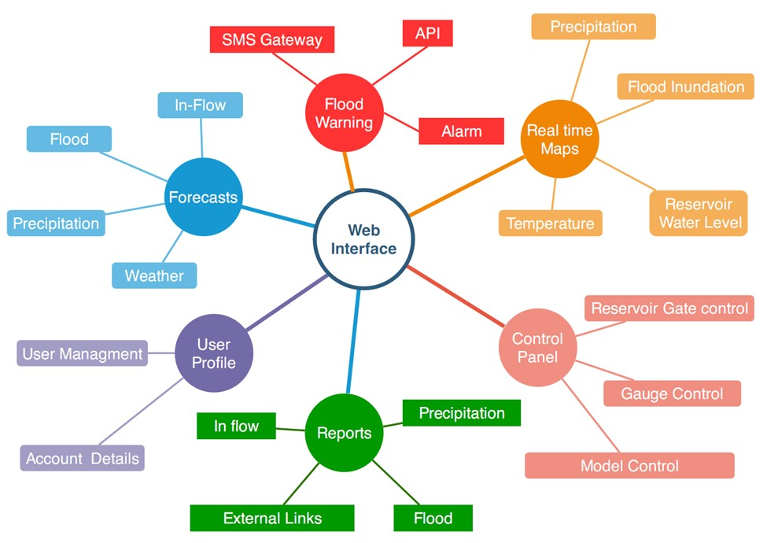

# Flood Forecasting System

## Team

- E/17/006, ALAHAKOON A.M.H.H, [e17006@eng.pdn.ac.lk](mailto:e17006@eng.pdn.ac.lk)
- E/17/176, KUMARA W.M.E.S.K, [e17176@eng.pdn.ac.lk](mailto:e17176@eng.pdn.ac.lk)
- E/17/338, SRIMAL R.M.L.C, [e17338@eng.pdn.ac.lk](mailto:e17338@eng.pdn.ac.lk)

## Table of Contents

1. [Introduction](#introduction)
2. [Solution](#Solution)
3. [Web Interface Overview](#web-Interface-Overview)
4. [Links](#links)

---

## Introduction

        Floods are the most destructive form of natural hazards in both local and global context. This is true in terms of both loss of life and property damage. Early flood forecasting can be used to identify potential areas of flooding in order to develop mitigatory planning and evacuation programs to remove people from such areas during flooding and also to implement suitable preventive measures to avoid damage to properties.
        In this project, our main objective is to build a flood forecasting system for Mi Oya river basin(Sri Lanka).Mi Oya Basin is heavily affected by seasonal flooding and droughts.

        As per the available data, floods in the Mi Oya basin are unleashed due to river overflow and reservoir spilling. Out of the several reservoirs located in the basin, Tabbowa and Inginimitiya are crucial in worsening the flood impacts as these two reservoirs are frequently spilling under adverse weather conditions. As such, the prevalence of a real-time flood forecasting model with the incorporation of the reservoir operations for the entire basin is essential to alleviate the flood induced impacts while preserving the optimum volume of water in the major reservoirs in the basin.

## Solution

        The proposed solution is to implement a simple data-driven or machine learning model to identify a direct mapping between the inputs(e.g., precipitation(P), temperature(T), potential evapotranspiration(PET), etc.) and outputs(In-flow level) without detailed consideration of the internal structure of the physical process.
        Also the system is consist of a web interface. The interface consists of three major modules as community view, control panel, and report. The warning messages are displayed with a map depicting the inundation extent in the community view, which is the interface for the public. Further, the community members are allowed to register their mobile numbers to receive warnings as SMS when such warnings are broadcasting at the disaster management center. A summary of past floods can be generated from the Report module for a required time period. Control panel provides access to the simulation module, gate operation module, flood warning dissemination module, access control module, etc. Only privileged users have access to the control panel. The figure below outlines the highlevel structure of the web application.

## Web Interface Overview

## Links

- [Project Repository](https://github.com/cepdnaclk/e17-co328-Flood-Forecasting-System)
- [Project Page](https://cepdnaclk.github.io/e17-co328-Flood-Forecasting-System/)
- [Department of Computer Engineering](http://www.ce.pdn.ac.lk/)
- [University of Peradeniya](https://eng.pdn.ac.lk/)
